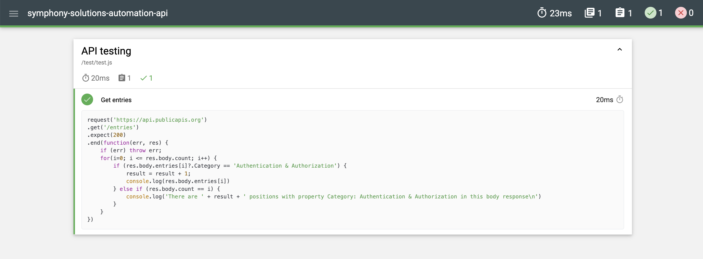

# Symphony Solutions challenge with API 

The repository was created to publish the code developed from a challenge proposed in Symphony Solutions' recruitment process. 

## Briefing

Create (design and implement) an automated API test using any JS framework or library (e.g., Request with Cypress; Playwright with request, etc.).

## Development tools 
* Supertest - https://www.npmjs.com/package/supertest
* Mocha - https://www.npmjs.com/package/mocha
* Mochawesome - https://www.npmjs.com/package/mochawesome

## How to run tests 

#### 1. Clone repository in your local environment 

# Symphony Solutions challenge with API 

The repository was created to publish the code developed from a challenge proposed in Symphony Solutions' recruitment process. 

## Briefing

Create (design and implement) an automated API test using any JS framework or library (e.g., Request with Cypress; Playwright with request, etc.).

## Development tools 
* Supertest - https://www.npmjs.com/package/supertest
* Mocha - https://www.npmjs.com/package/mocha
* Mochawesome - https://www.npmjs.com/package/mochawesome

## How to run tests 

#### 1. Clone repository in your local environment 


# Symphony Solutions challenge with API 

The repository was created to publish the code developed from a challenge proposed in Symphony Solutions' recruitment process. 

## Briefing

Create (design and implement) an automated API test using any JS framework or library (e.g., Request with Cypress; Playwright with request, etc.).

## Development tools 
* Supertest - https://www.npmjs.com/package/supertest
* Mocha - https://www.npmjs.com/package/mocha
* Mochawesome - https://www.npmjs.com/package/mochawesome

## How to run tests 

#### 1. Install Node.JS 
https://nodejs.org/en/download

#### 2. Install npm
To do this, you can use Homebrew to install npm package globally - https://brew.sh/
```bash 
brew install -g npm 
```
#### 3. Check the versions to see if the installations were successful 
```bash 
node --version 
npm --version 
```
This project used: 
```bash 
node --version 
v18.18.0
npm --version 
9.8.1
```

#### 4. Clone repository in your local environment using script in your terminal 
```bash
git clone https://github.com/amandacosqa/symphony-solutions-automation-api.git
```

#### 5. Install the project dependencies 
```bash 
npm install 
```

#### 6. Run tests 
```bash 
npm test 
```

## How tests are reported
* Mochawesome


* In the terminal console

```bash 
> symphony-solutions-automation-api@1.0.0 test
> mocha test --reporter mochawesome


  API testing
    ✔ Get entries


  1 passing (24ms)

[mochawesome] Report JSON saved to /Users/amandaoliveira/Documents/Github/symphony-solutions-automation-api/mochawesome-report/mochawesome.json

[mochawesome] Report HTML saved to /Users/amandaoliveira/Documents/Github/symphony-solutions-automation-api/mochawesome-report/mochawesome.html

{
  API: 'Auth0',
  Description: 'Easy to implement, adaptable authentication and authorization platform',
  Auth: 'apiKey',
  HTTPS: true,
  Cors: 'yes',
  Link: 'https://auth0.com',
  Category: 'Authentication & Authorization'
}
{
  API: 'GetOTP',
  Description: 'Implement OTP flow quickly',
  Auth: 'apiKey',
  HTTPS: true,
  Cors: 'no',
  Link: 'https://otp.dev/en/docs/',
  Category: 'Authentication & Authorization'
}
{
  API: 'Micro User Service',
  Description: 'User management and authentication',
  Auth: 'apiKey',
  HTTPS: true,
  Cors: 'no',
  Link: 'https://m3o.com/user',
  Category: 'Authentication & Authorization'
}
{
  API: 'MojoAuth',
  Description: 'Secure and modern passwordless authentication platform',
  Auth: 'apiKey',
  HTTPS: true,
  Cors: 'yes',
  Link: 'https://mojoauth.com',
  Category: 'Authentication & Authorization'
}
{
  API: 'SAWO Labs',
  Description: 'Simplify login and improve user experience by integrating passwordless authentication in your app',
  Auth: 'apiKey',
  HTTPS: true,
  Cors: 'yes',
  Link: 'https://sawolabs.com',
  Category: 'Authentication & Authorization'
}
{
  API: 'Stytch',
  Description: 'User infrastructure for modern applications',
  Auth: 'apiKey',
  HTTPS: true,
  Cors: 'no',
  Link: 'https://stytch.com/',
  Category: 'Authentication & Authorization'
}
{
  API: 'Warrant',
  Description: 'APIs for authorization and access control',
  Auth: 'apiKey',
  HTTPS: true,
  Cors: 'yes',
  Link: 'https://warrant.dev/',
  Category: 'Authentication & Authorization'
}
There are 7 positions with property Category: Authentication & Authorization in this body response
```